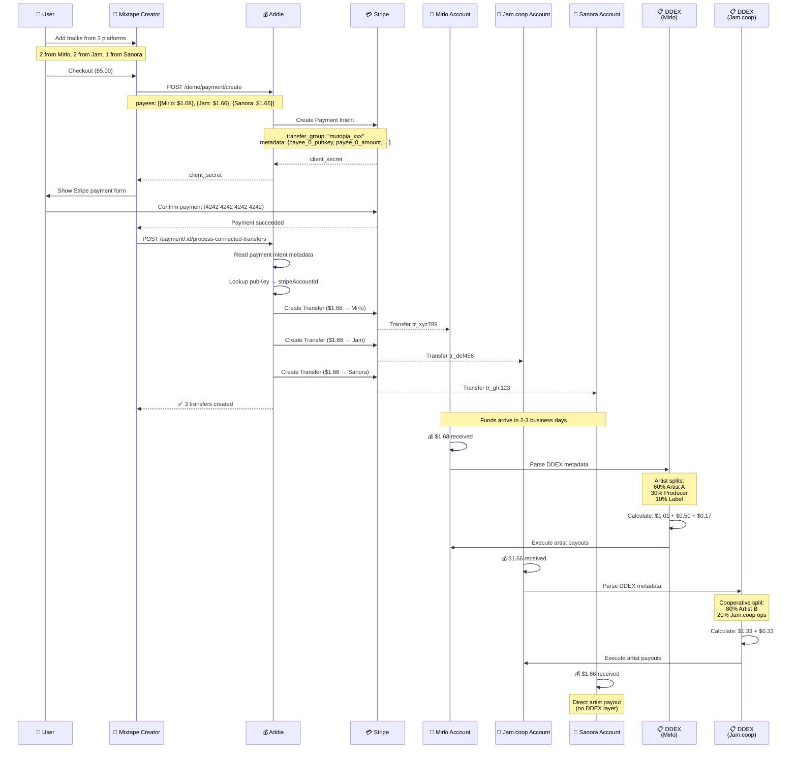
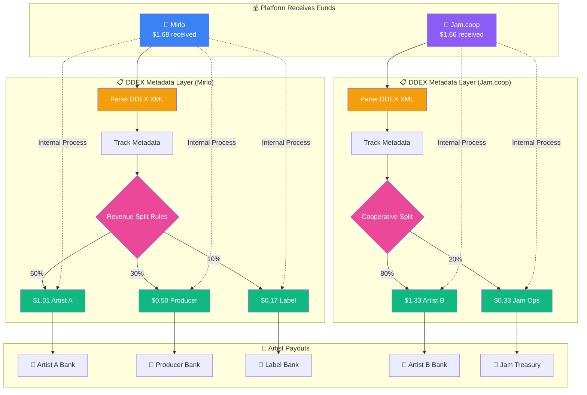
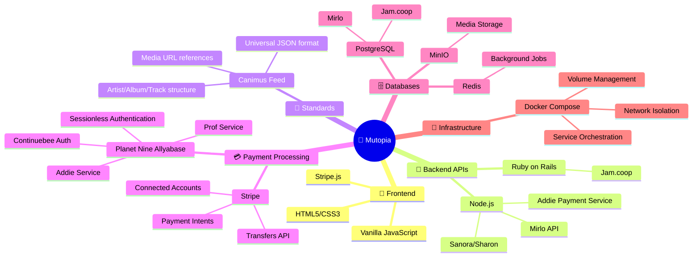
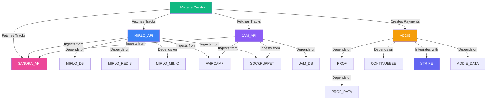

# Mutopia Architecture Diagram

## System Overview

Mutopia is a distributed multi-platform music sharing and purchasing network that integrates decentralized music platforms via Canimus feeds and enables revenue splits through Stripe Connected Accounts.

```mermaid
graph TB
    subgraph "🎧 User Experience"
        USER[👤 Music Fan]
        MIXTAPE[🎵 Mixtape Creator<br/>localhost:3003]
    end

    subgraph "🎼 Content Sources (Canimus Feed Producers)"
        MIRLO_CLIENT[🎨 Mirlo Client<br/>React Frontend<br/>localhost:3000]
        MIRLO_API[🔌 Mirlo API<br/>localhost:3001]
        JAM_COOP[🤝 Jam.coop<br/>Rails App<br/>localhost:3002]
        SANORA[📚 Sanora/Allyabase<br/>Sharon Test Server<br/>localhost:9090]
        FAIRCAMP[🏕️ Faircamp<br/>Static Site<br/>localhost:8000]
        SOCKPUPPET[🎭 Sockpuppet<br/>External<br/>sockpuppet.band]
    end

    subgraph "🎵 Canimus Feed Layer"
        CANIMUS_MIRLO[📡 Canimus Feed<br/>Mirlo]
        CANIMUS_JAM[📡 Canimus Feed<br/>Jam.coop]
        CANIMUS_SANORA[📡 Canimus Feed<br/>Sanora]
        CANIMUS_FAIRCAMP[📡 Canimus Feed<br/>Faircamp]
        CANIMUS_SOCKPUPPET[📡 Canimus Feed<br/>Sockpuppet]
    end

    subgraph "💳 Payment Infrastructure (Planet Nine Allyabase)"
        ADDIE[💰 Addie<br/>Payment Processing<br/>localhost:3004]
        CONTINUEBEE[🔐 Continuebee<br/>Authentication<br/>localhost:5112]
        PROF[👤 Prof<br/>Profile/PII<br/>localhost:5108]
    end

    subgraph "💸 Stripe Integration"
        STRIPE_PLATFORM[💳 Stripe Platform]

        subgraph "Connected Accounts"
            STRIPE_MIRLO[🏦 Mirlo Account<br/>acct_1SVHLg...]
            STRIPE_JAM[🏦 Jam.coop Account<br/>acct_1SVHLi...]
            STRIPE_SANORA[🏦 Sanora Account<br/>acct_1SVHLl...]
        end

        subgraph "Bank Accounts"
            BANK_MIRLO[🏦 Test Bank<br/>...6789]
            BANK_JAM[🏦 Test Bank<br/>...6789]
            BANK_SANORA[🏦 Test Bank<br/>...6789]
        end
    end

    subgraph "🗄️ Data Storage"
        MIRLO_DB[(🐘 PostgreSQL<br/>Mirlo DB)]
        MIRLO_REDIS[(📮 Redis<br/>Background Jobs)]
        MIRLO_MINIO[(📦 MinIO<br/>Media Storage)]
        JAM_DB[(🐘 PostgreSQL<br/>Jam.coop DB)]
        PROF_DATA[(💾 Prof Data)]
        ADDIE_DATA[(💾 Addie Data)]
    end

    %% User Flow
    USER -->|Browses Music| MIXTAPE
    MIXTAPE -->|Fetches Tracks| CANIMUS_MIRLO
    MIXTAPE -->|Fetches Tracks| CANIMUS_JAM
    MIXTAPE -->|Fetches Tracks| CANIMUS_SANORA
    MIXTAPE -->|Creates Payment Intent| ADDIE
    MIXTAPE -->|Processes Payment| STRIPE_PLATFORM
    MIXTAPE -->|Triggers Transfers| ADDIE

    %% Content Sources to Canimus Feeds
    MIRLO_API -->|Publishes| CANIMUS_MIRLO
    JAM_COOP -->|Publishes| CANIMUS_JAM
    SANORA -->|Publishes| CANIMUS_SANORA
    FAIRCAMP -->|Publishes| CANIMUS_FAIRCAMP
    SOCKPUPPET -->|Publishes| CANIMUS_SOCKPUPPET

    %% Mirlo Stack
    MIRLO_CLIENT -->|API Calls| MIRLO_API
    MIRLO_API -->|Reads/Writes| MIRLO_DB
    MIRLO_API -->|Background Jobs| MIRLO_REDIS
    MIRLO_API -->|Media Files| MIRLO_MINIO

    %% Jam.coop Stack
    JAM_COOP -->|Reads/Writes| JAM_DB

    %% Allyabase Stack
    ADDIE -->|User Lookup| PROF
    ADDIE -->|Auth Verification| CONTINUEBEE
    ADDIE -->|Stores Data| ADDIE_DATA
    PROF -->|Stores Profiles| PROF_DATA

    %% Stripe Payment Flow
    ADDIE -->|Creates Payment Intent| STRIPE_PLATFORM
    ADDIE -->|Creates Transfers| STRIPE_MIRLO
    ADDIE -->|Creates Transfers| STRIPE_JAM
    ADDIE -->|Creates Transfers| STRIPE_SANORA

    %% Stripe Payouts
    STRIPE_MIRLO -->|2-3 Days| BANK_MIRLO
    STRIPE_JAM -->|2-3 Days| BANK_JAM
    STRIPE_SANORA -->|2-3 Days| BANK_SANORA

    %% Styling
    classDef userStyle fill:#10b981,stroke:#059669,stroke-width:3px,color:#fff
    classDef contentStyle fill:#3b82f6,stroke:#2563eb,stroke-width:2px,color:#fff
    classDef feedStyle fill:#8b5cf6,stroke:#7c3aed,stroke-width:2px,color:#fff
    classDef paymentStyle fill:#f59e0b,stroke:#d97706,stroke-width:2px,color:#fff
    classDef stripeStyle fill:#6366f1,stroke:#4f46e5,stroke-width:2px,color:#fff
    classDef dbStyle fill:#ec4899,stroke:#db2777,stroke-width:2px,color:#fff
    classDef bankStyle fill:#14b8a6,stroke:#0d9488,stroke-width:2px,color:#fff

    class USER,MIXTAPE userStyle
    class MIRLO_CLIENT,MIRLO_API,JAM_COOP,SANORA,FAIRCAMP,SOCKPUPPET contentStyle
    class CANIMUS_MIRLO,CANIMUS_JAM,CANIMUS_SANORA,CANIMUS_FAIRCAMP,CANIMUS_SOCKPUPPET feedStyle
    class ADDIE,CONTINUEBEE,PROF paymentStyle
    class STRIPE_PLATFORM,STRIPE_MIRLO,STRIPE_JAM,STRIPE_SANORA stripeStyle
    class MIRLO_DB,MIRLO_REDIS,MIRLO_MINIO,JAM_DB,PROF_DATA,ADDIE_DATA dbStyle
    class BANK_MIRLO,BANK_JAM,BANK_SANORA bankStyle
```

## Revenue Split Flow

## DDEX Artist Revenue Distribution

**Note**: DDEX (Digital Data Exchange) is an industry-standard XML format for exchanging music metadata, including artist splits, royalty shares, and contributor information. Mirlo and Jam.coop parse DDEX data to automatically distribute platform revenue to individual artists, producers, and labels according to pre-defined split agreements. Sanora uses direct artist payouts without a DDEX layer.

## Platform Setup Flow

```mermaid
flowchart LR
    subgraph "1️⃣ Platform Registration"
        A[Generate Sessionless Keys] --> B[Create Addie User]
        B --> C[Create Stripe Connected Account]
    end

    subgraph "2️⃣ Account Configuration"
        C --> D{business_type: 'company'}
        D --> E[Add company info<br/>tax_id: '000000000']
        E --> F[Add address<br/>'address_full_match']
        F --> G[Add business profile<br/>url: 'https://allyabase.com']
    end

    subgraph "3️⃣ Capability Activation"
        G --> H{Check Capabilities}
        H -->|❌ inactive| I[Update Account Info]
        I --> H
        H -->|✅ active| J[Add External Bank Account]
    end

    subgraph "4️⃣ Ready to Receive"
        J --> K[✅ Platform Ready]
        K --> L[Can receive transfers!]
    end

    style A fill:#10b981,color:#fff
    style B fill:#3b82f6,color:#fff
    style C fill:#f59e0b,color:#fff
    style D fill:#ec4899,color:#fff
    style E fill:#8b5cf6,color:#fff
    style F fill:#06b6d4,color:#fff
    style G fill:#f59e0b,color:#fff
    style H fill:#6366f1,color:#fff
    style I fill:#ef4444,color:#fff
    style J fill:#14b8a6,color:#fff
    style K fill:#22c55e,color:#fff
    style L fill:#22c55e,color:#fff
```

## Data Flow: Track Discovery to Payment

```mermaid
graph LR
    subgraph "🎵 Content Layer"
        A1[Artist on Mirlo] --> A2[Upload Track]
        B1[Artist on Jam.coop] --> B2[Upload Track]
        C1[Artist on Sanora] --> C2[Upload Track]
    end

    subgraph "📡 Canimus Layer"
        A2 --> A3[Canimus Feed JSON]
        B2 --> B3[Canimus Feed JSON]
        C2 --> C3[Canimus Feed JSON]
    end

    subgraph "🔍 Discovery Layer"
        A3 --> D1{Mixtape Creator<br/>Aggregation}
        B3 --> D1
        C3 --> D1
        D1 --> D2[Unified Track List]
    end

    subgraph "👤 User Layer"
        D2 --> E1[User Browses]
        E1 --> E2[Adds to Mixtape]
        E2 --> E3[Checkout]
    end

    subgraph "💳 Payment Layer"
        E3 --> F1[Create Payment Intent]
        F1 --> F2[User Pays]
        F2 --> F3[Split Calculation]
        F3 --> F4[Transfer to Platforms]
    end

    subgraph "💰 Revenue Distribution"
        F4 --> G1[🏦 Mirlo Receives $]
        F4 --> G2[🏦 Jam.coop Receives $]
        F4 --> G3[🏦 Sanora Receives $]
    end

    style A2 fill:#10b981,color:#fff
    style B2 fill:#3b82f6,color:#fff
    style C2 fill:#8b5cf6,color:#fff
    style D1 fill:#f59e0b,color:#fff
    style E2 fill:#ec4899,color:#fff
    style F2 fill:#6366f1,color:#fff
    style G1 fill:#14b8a6,color:#fff
    style G2 fill:#14b8a6,color:#fff
    style G3 fill:#14b8a6,color:#fff
```

## Technology Stack

## Service Dependencies

## Color Key

- 🟢 **Green**: User-facing applications
- 🔵 **Blue**: Content platforms (Mirlo, Jam.coop)
- 🟣 **Purple**: Canimus feeds & data distribution
- 🟠 **Orange**: Payment & authentication services
- 🟦 **Indigo**: Stripe integration
- 🟪 **Pink**: Databases & storage
- 🟩 **Teal**: Bank accounts & payouts

---

## Quick Reference

### Port Map
- **3000**: Mirlo Client (React)
- **3001**: Mirlo API
- **3002**: Jam.coop (Rails)
- **3003**: Mixtape Creator (User-facing)
- **3004**: Addie (Payment processing)
- **5108**: Prof (Profile service)
- **5112**: Continuebee (Auth service)
- **8000**: Faircamp (Static site)
- **9000**: MinIO API
- **9001**: MinIO Console
- **9090**: Sanora/Sharon test server

### Key Accounts (Test Mode)
- **Mirlo**: `acct_1SVHLgEdYWVNQz9u`
- **Jam.coop**: `acct_1SVHLiEuxzeWyjJN`
- **Sanora**: `acct_1SVHLlIuge6KFQnD`

### Test Card
- **Number**: 4242 4242 4242 4242
- **Exp**: Any future date
- **CVC**: Any 3 digits
- **ZIP**: Any 5 digits
